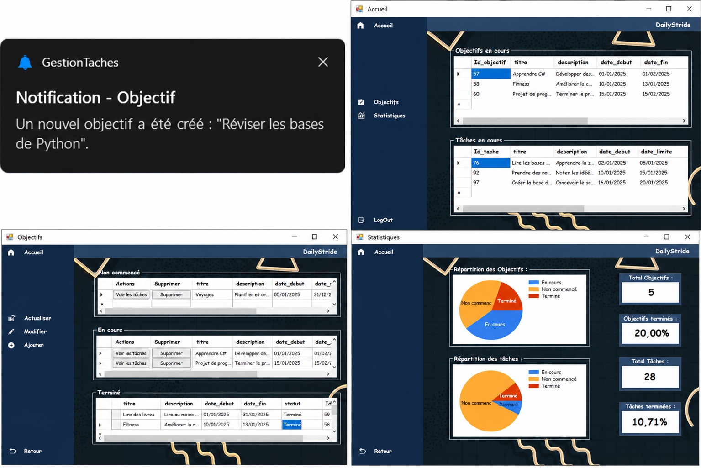

<div align="center">

# 🎯 Gestion des Tâches (DailyStride) — Application C#

**Application de bureau pour l'organisation et le suivi des objectifs et tâches personnels et professionnels**

[](https://docs.microsoft.com/en-us/dotnet/csharp/)
[](https://dotnet.microsoft.com/)
[](https://www.microsoft.com/sql-server/)
[](https://visualstudio.microsoft.com/)

*Mini Projet Système d'Information — LST Informatique*

---

</div>

## 📋 Table des Matières

- [Présentation](#-présentation)
- [Fonctionnalités](#-fonctionnalités)
- [Architecture & Base de Données](#-architecture--base-de-données)
- [Captures d'écran](#-captures-décran)
- [Installation](#-installation)
- [Technologies](#-technologies-utilisées)
- [Auteurs](#-auteurs)

---

## 🚀 Présentation

**DailyStride** est une application de bureau intuitive développée en **C# (.NET)** dans le cadre d'un mini-projet universitaire. Son ambition principale est de fournir un environnement centralisé facilitant la planification, le suivi et la structuration des activités quotidiennes, qu'elles soient personnelles ou professionnelles.

Face aux exigences croissantes de la vie moderne, DailyStride permet d'organiser ses objectifs en sous-tâches, de suivre son avancement grâce à des statistiques visuelles, et de ne jamais manquer une échéance grâce à un système intelligent de rappels et de notifications.

### Objectifs du Projet

| Objectif | Description |
|----------|-------------|
| 📅 **Planification** | Création et gestion d'objectifs décomposables en plusieurs tâches. |
| 🔔 **Notifications** | Système d'alertes pour les échéances, les retards, et les succès (notifications Windows). |
| 📊 **Suivi Visuel** | Tableaux de bord et graphiques statistiques pour visualiser l'avancement. |
| 🔒 **Sécurité** | Inscription et connexion sécurisées pour la confidentialité des données utilisateurs. |

---

## ✨ Fonctionnalités

### 👤 Gestion des Utilisateurs
- Inscription de nouveaux utilisateurs (Nom, Prénom, Email, Mot de passe).
- Connexion (Login) avec vérification sécurisée des identifiants.
- Déconnexion rapide et sécurisée.

### 🎯 Gestion des Objectifs
- Ajout de nouveaux objectifs avec titre, description, dates de début et fin.
- Catégorisation automatique selon le statut : **Non commencé**, **En cours**, **Terminé**.
- Modification et suppression des objectifs existants.

### 📝 Gestion des Tâches
- Ajout de tâches associées à un objectif précis.
- Définition des niveaux de priorité : **Haute**, **Moyenne**, **Basse**.
- Suivi du statut des tâches : **Non commencé**, **En cours**, **Terminé**, **Abandonné**.
- Actualisation, modification et suppression des tâches.

### 📈 Statistiques & Graphiques
- Répartition visuelle (camemberts/diagrammes) des objectifs par statut.
- Répartition des tâches avec pourcentages d'accomplissement.
- Vue globale sur la productivité de l'utilisateur.

### 🔔 Système de Notifications
- **Rappels automatiques :** Alertes envoyées un jour avant la date limite ou si la tâche est en retard.
- **Feedback visuel :** Notifications confirmant la création, modification, ou réussite d'un objectif/tâche.
- Alertes discrètes de type "Toast" intégrées au système d'exploitation.

---

## 🏗️ Architecture & Base de Données

Le projet a été modélisé en utilisant la méthodologie **MERISE** (MCD, MLD, MPD, MCC, MCT, MOT).

### Modèle Relationnel de Données
La base de données relationnelle est construite sur **Microsoft SQL Server** et interagit avec l'application via **ADO.NET** en utilisant des procédures stockées pour optimiser les performances. Les entités principales sont :

- **Utilisateur :** `(Id_utilisateur, nom, prenom, date_naissance, email, mot_de_passe)`
- **Objectif :** `(Id_objectif, titre, description, date_debut, date_fin, statut, #Id_utilisateur)`
- **Tache :** `(Id_tache, titre, description, date_debut, date_limite, statut, Priorite, #Id_utilisateur, #Id_objectif)`
- **Notification :** `(Id_notification, date_envoie, type, message, affichage, #Id_utilisateur, #Id_objectif, #Id_tache)`

---

## 📸 Captures d'écran

<p align="center">
  
</p>

---

## 🛠️ Installation

### Prérequis

- **Microsoft Visual Studio** (2019 ou plus récent).
- **Microsoft SQL Server** et SQL Server Management Studio (SSMS).
- **.NET Framework** installé sur votre machine.

### Instructions

1. **Cloner le dépôt** :
   ```bash
   git clone https://github.com/votre-utilisateur/DailyStride-GestionTaches.git
   ```

2. **Configuration de la Base de Données** :
   - Ouvrez SSMS.
   - Exécutez le script SQL fourni `GestionTachesDB.sql` pour créer la base de données, les tables, et les procédures stockées.

3. **Configuration de la Connexion** :
   - Ouvrez le projet dans Visual Studio.
   - Localisez la chaîne de connexion (Connection String) dans le code (généralement dans `App.config` ou dans les classes d'accès aux données) et modifiez le nom du serveur pour qu'il corresponde à votre instance SQL Server locale.

4. **Lancement** :
   - Compilez le projet.
   - Lancez l'application en mode Debug (F5).

---

## 💻 Technologies Utilisées

| Catégorie | Technologie |
|-----------|-------------|
| **Langage de programmation** | C# |
| **Framework** | .NET Framework (Windows Forms) |
| **Accès aux données** | ADO.NET |
| **SGBD (Base de données)** | Microsoft SQL Server |
| **Modélisation** | Méthode MERISE |
| **IDE** | Microsoft Visual Studio Code / Visual Studio |
| **Gestion de projet** | GanttProject |
| **Contrôle de version** | Git / GitHub |

---

## 👥 Auteurs

Ce projet a été réalisé par le **Groupe 12** de la LST Informatique :

- **AGUELLOUL Mouad**
- **EDDAHANI Ouissal**
- **BOURTI Ayoub**
- **DAHIBI Wissal**
- **AGAZZAR Amina**

**Encadré par :** Pr. IDRISSI Najlae  
*Année Universitaire : 2024-2025 (Faculté des Sciences et Techniques, Université Sultan Moulay Slimane)*

---

<div align="center">

*DailyStride — Votre compagnon pour une productivité optimale.*

</div>
